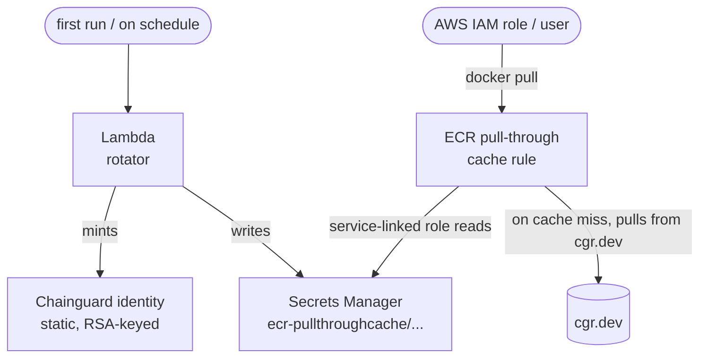

# aws-ecr-pull-through

Terraform module that configures an **AWS ECR pull-through cache** for `cgr.dev`. The pull token is automatically rotated by a scheduled Lambda function.

## How it works



1. The Lambda authenticates to the Chainguard API using an [assumable identity](https://edu.chainguard.dev/chainguard/administration/assumable-ids/identity-examples/aws-identity-oidc/).
2. It creates a pull token.
3. It updates the Secrets Manager secret used by the pull-through cache rule.
4. On each rotation, the Lambda deletes expired tokens.

---

## Prerequisites

### Tools

- [Terraform](https://developer.hashicorp.com/terraform/install) >= 1.5
- [AWS CLI](https://docs.aws.amazon.com/cli/latest/userguide/getting-started-install.html) — authenticated (`aws configure` or `AWS_PROFILE`)
- [Chainguard CLI (`chainctl`)](https://edu.chainguard.dev/chainguard/chainguard-enforce/how-to-install-chainctl/) — authenticated with `chainctl auth login`
- [`ko`](https://ko.build/) credential helper available so Terraform can push the Lambda image to ECR

### AWS account configuration

[Outbound identity federation](https://docs.aws.amazon.com/IAM/latest/UserGuide/id_credentials_outbound_identity_federation.html) must be enabled on the AWS account. This is the mechanism the Lambda uses to authenticate to Chainguard.

### AWS permissions

The identity running Terraform needs to create:

- ECR repositories and pull-through cache rules
- Secrets Manager secrets
- IAM roles + inline policies
- Lambda functions (and invoke them once for bootstrap)
- EventBridge schedules

### Chainguard permissions

The identity running Terraform needs **Owner** or **Editor** on the target Chainguard group to create the Lambda's identity, the custom cleaner role, and the role bindings.

---

## Deployment

### 1. Authenticate

```sh
aws configure   # or set AWS_PROFILE
chainctl auth login
```

### 2. Configure

Set your tfvars (at minimum, `org_name`):

```hcl
# iac/terraform.tfvars
org_name = "your.org"
```

### 3. Apply

```sh
cd iac
tf init
tf apply
```

### 4. Use the cache

```sh
PREFIX=$(tf output -raw pull_through_cache_uri)
docker pull ${PREFIX}/<image>:<tag>
# e.g. for cgr.dev/your.org/python:latest
docker pull ${PREFIX}/python:latest
```

The first pull of any tag is slow (ECR fetches it from `cgr.dev` synchronously and creates the cached repo). Subsequent pulls are cached.

---

## Operations

### Force a rotation

```sh
aws lambda invoke --function-name $(tf output -raw rotator_function_name) /dev/null
```

### Inspect minted pull tokens

```sh
chainctl iam identity list --parent $(tf output -raw chainguard_identity_id | cut -d/ -f1) --type pull_token
```

### Teardown

```sh
cd iac
tf destroy
```

**Note**: pull-token identities the Lambda created in Chainguard are not deleted by `tf destroy` — they'll expire on their own (within `token_ttl`). To remove them immediately, list them with `chainctl iam identity list` and delete them manually.

---

## Resources created

### AWS

| Resource | Notes |
|---|---|
| `aws_ecr_pull_through_cache_rule` | Maps `cgr.dev/<group>` to the local `<ecr_repository_prefix>` namespace |
| `aws_secretsmanager_secret` | Named `ecr-pullthroughcache/<name>`; holds the rotated pull token |
| `aws_secretsmanager_secret_version` | Initial placeholder; `secret_string` is owned by the Lambda thereafter (`ignore_changes`) |
| `aws_ecr_repository` | Dedicated repo for the rotator Lambda's container image |
| `aws_iam_role` (lambda) | Lambda execution role with `secretsmanager:PutSecretValue` on the secret |
| `aws_iam_role` (scheduler) | EventBridge Scheduler role that invokes the Lambda |
| `aws_lambda_function` | The rotator, packaged as an OCI image built with `ko` |
| `aws_lambda_invocation` | One-shot bootstrap so the secret is populated immediately on apply |
| `aws_scheduler_schedule` | Recurring rotation (default `rate(1 day)`) |

### Chainguard

| Resource | Description |
|---|---|
| `chainguard_identity` | Workload identity for the Lambda, bound to the AWS role |
| `chainguard_rolebinding` (creator) | Grants the built-in `registry.pull_token_creator` role on the group |
| `chainguard_role` (cleaner) | Custom role with `iam.identities.delete` only |
| `chainguard_rolebinding` (cleaner) | Grants the custom cleaner role to the Lambda's identity |

The Lambda also creates one `chainguard_identity` (of type static, with an attached `chainguard_rolebinding`) per rotation. These are the actual pull tokens — outside Terraform's management — and the Lambda is responsible for deleting them once they expire.

---

## Variables

| Variable | Required | Default | Description |
|---|---|---|---|
| `org_name` | yes | — | Chainguard organization name (e.g. `your.org`) |
| `suffix` | no | (random) | Suffix appended to every resource name; auto-generated if empty |
| `ecr_repository_prefix` | no | `chainguard-<suffix>` | Local ECR namespace for cached images |
| `upstream_repository_prefix` | no | `var.org_name` | Upstream prefix on `cgr.dev` |
| `token_ttl` | no | `336h` | Pull-token lifetime as a Go duration string (e.g. `336h` = 14 days) |
| `rotation_schedule` | no | `rate(1 day)` | EventBridge schedule expression for rotation |

---

## Outputs

| Output | Description |
|---|---|
| `suffix` | Suffix used across all resource names in this deployment |
| `ecr_repository_prefix` | ECR namespace for cached images |
| `pull_through_cache_uri` | Full base URI to pull through (e.g. `123456789.dkr.ecr.us-east-1.amazonaws.com/cgr`) |
| `secret_arn` | ARN of the Secrets Manager secret backing the cache rule |
| `rotator_function_name` | Lambda function name for the rotator |
| `chainguard_identity_id` | Chainguard identity ID for the rotator Lambda |

