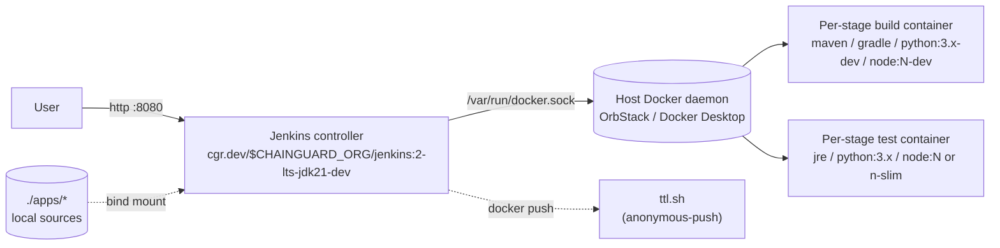

# Chainguard Jenkins Demo

A self-contained Jenkins server running on Chainguard images, with seven pipeline jobs that build and test sample applications across Java, Python, and Node — using Chainguard `*-dev` build images and Chainguard runtime images throughout.

All Jenkins infrastructure and all build/test/runtime images come from `cgr.dev/<your-chainguard-org>` (default `smalls.xyz` — see [Configuration](#configuration)).

## Sample applications

| Job name | Stack | Build image | Runtime image | Artifact |
|----------|-------|-------------|---------------|----------|
| [`corretto-java17-maven`](apps/corretto-java17-maven/)   | Spring Boot console app, Maven  | `maven:3-jdk17-dev`     | `amazon-corretto-jre:17`    | runnable JAR (Jenkins archive) |
| [`adoptium-java8-jetty`](apps/adoptium-java8-jetty/)     | JSP web app, Maven, Jetty 9.4   | `maven:3-jdk8-dev`      | `adoptium-jre:adoptium-openjdk-8` | runnable WAR (Jenkins archive) |
| [`openjdk21-gradle`](apps/openjdk21-gradle/)             | CLI app, Gradle 8.14            | `jdk:openjdk-21-dev`    | `jre:openjdk-21`            | runnable JAR (Jenkins archive) |
| [`python314-uv-flask`](apps/python314-uv-flask/)         | Flask web app, `uv`             | `python:3.14-dev`       | `python:3.14`               | OCI image → `ttl.sh/smalls-pytest:3-14` |
| [`python312-pip-django`](apps/python312-pip-django/)     | Django site, `pip`              | `python:3.12-dev`       | `python:3.12`               | OCI image → `ttl.sh/smalls-pytest:3-12` |
| [`node22-npm-express`](apps/node22-npm-express/)         | Express web app, `npm`          | `node:22-dev`           | `node:22`                   | OCI image → `ttl.sh/smalls-nodetest:22` |
| [`node25-pnpm-express`](apps/node25-pnpm-express/)       | Express web app, `pnpm`         | `node:25-dev`           | `node:25-slim`              | OCI image → `ttl.sh/smalls-nodetest:25` |

(Java pipelines archive their build artifact directly into Jenkins. Python/Node pipelines build an OCI image and push it to [ttl.sh](https://ttl.sh/) — an anonymous-push registry where tags expire after 24h. Re-run a pipeline to refresh.)

## How it works



Jenkins is built from [Dockerfile.jenkins](Dockerfile.jenkins), which layers a fixed plugin set and the Chainguard `docker-cli` binary onto `cgr.dev/$CHAINGUARD_ORG/jenkins:2-lts-jdk21-dev` (the controller runs on JDK 21; sample apps targeting older JDKs build inside their own per-stage Chainguard images). On startup, [Jenkins Configuration as Code (JCasC)](jenkins/casc/jenkins.yaml) creates the admin user and seeds pipeline jobs from [jobs.groovy](jenkins/casc/jobs.groovy) by reading each app's `Jenkinsfile` from disk.

The controller talks to the **host's Docker daemon** via the mounted `/var/run/docker.sock` (DooD pattern). When a pipeline stage uses `agent { docker { image '...' } }`, Jenkins asks the host to spawn the build container. To make this work cleanly, `JENKINS_HOME` is bind-mounted from `/tmp/cgjenkins-home` at the **same absolute path on host and container** — so when the controller hands the host a `-v <workspace>:<workspace>` flag, the workspace path actually exists on the host.

Each sample application lives under [apps/](apps/) as if it were a separate repository. The controller's first pipeline stage (`Checkout`) copies the app sources from the bind-mounted `/sources/apps/<name>/` into the workspace. Subsequent stages stash/unstash to share artifacts.

Pipelines never hardcode image strings. Instead they call `cgImage('<token>')` from the [cgImages shared library](shared-libraries/cg-images/) — e.g. `cgImage('corretto-java17').build` resolves to the right `cgr.dev/<org>/maven:3-jdk17-dev@sha256:<digest>`. Catalog entries are pinned by digest for reproducibility. The library is auto-loaded by JCasC from a bind-mounted filesystem path, so adding/changing a token is a one-file edit and the next pipeline run picks it up automatically (no controller restart needed). See the library's [README](shared-libraries/cg-images/README.md#caveats) for caveats around editing it.

A scheduled Jenkins job, [refresh-cgimages-digests](ops/refresh-cgimages-digests/), re-resolves every catalog entry against the registry every 4 hours so digest pins keep up with upstream tag movements automatically.

## Prerequisites

- Docker (Docker Desktop, OrbStack, or Linux Docker engine)
- `chainctl` CLI, authenticated against an org with access to `cgr.dev/<your-org>/*`

Verify auth:
```sh
chainctl auth status
```

## Configuration

The demo defaults to pulling Chainguard images from `cgr.dev/smalls.xyz/`. To use a different org (e.g. the public `chainguard` catalog or your own org):

```sh
cp .env.example .env
# edit CHAINGUARD_ORG in .env
```

`.env` is loaded automatically by `docker-compose`, propagated to the controller container as an env var, and consumed by Jenkinsfiles (via `env.CHAINGUARD_ORG`), the controller Dockerfile, and per-app Dockerfiles (via build ARG). `setup.sh` also sources `.env`, so the pull token is generated against the configured org.

After changing the org, re-run the bootstrap and rebuild — the Chainguard assumed identity is org-scoped, so the existing one becomes invalid for the new org:
```sh
docker compose up -d --build
./setup.sh
```

## Quick start

The demo uses **OIDC assumed identity** auth — Jenkins itself signs short-lived JWTs per build, and pipelines exchange them for ~30-min Chainguard sessions via `chainctl auth login`. No long-lived pull tokens on disk.

**Step 1 — Start Jenkins.**

```sh
cd jenkins
docker compose up -d --build
```

The controller image bakes in `chainctl` (multi-stage-copied from `cgr.dev/$CHAINGUARD_ORG/chainctl`) so pipelines can run it without an extra agent.

**Step 2 — Bootstrap the Chainguard assumed identity.** [setup.sh](setup.sh) waits for Jenkins to come up, fetches its OIDC JWKS, then runs Terraform under [iac/](iac/) to create a `chainguard_identity` (`static` block, JWKS uploaded directly) and a `registry.pull` rolebinding. The identity's UIDP is written to `shared-libraries/cg-images/IDENTITY` (gitignored), which the `cgLogin` shared-library var reads at build time.

```sh
./setup.sh
```

> **Important:** Re-run `setup.sh` after **any** of these:
> - First-time bootstrap.
> - Changing `CHAINGUARD_ORG` in `.env`.
> - **Any restart of the Jenkins controller** (`docker compose restart jenkins`, `docker compose up -d --force-recreate`, or `down`/`up`). The `oidc-provider` plugin regenerates the credential's RSA signing key on JCasC re-apply, which immediately invalidates the JWKS we previously uploaded to Chainguard. `setup.sh` re-fetches the new JWKS and re-applies Terraform; the identity object is updated in place (its UIDP changes, hence the per-restart re-write of the `IDENTITY` file).

Wait ~30s for Jenkins to finish initial startup (watch with `docker compose logs -f jenkins`), then open <http://localhost:8080> and log in:

- Username: `admin`
- Password: `admin` (override via `JENKINS_ADMIN_PASSWORD` env in [docker-compose.yml](docker-compose.yml))

You should see all seven jobs in the dashboard. Click any of them → **Build Now**. Each pipeline runs roughly the same shape:

1. **Auth** — `cgLogin()` (a shared-library var) exchanges a fresh per-build Jenkins OIDC token for a short-lived Chainguard session, then writes a docker config that the rest of the build reuses.
2. **Checkout** — `cp -R /sources/apps/<name>/. .` from the bind-mounted source dir into the build workspace.
3. **Build (deps)** — install/compile in a Chainguard `*-dev` agent container.
4. **Test** — smoke-test in either the runtime image or its `-dev` variant (see [Common gotchas](#common-gotchas) below).
5. **Archive / Push** — for the Java pipelines, archive the JAR/WAR to Jenkins. For Python/Node, build a runtime OCI image and push to `ttl.sh`.

A clean build takes 10s–40s once images are cached locally; the Gradle pipeline is slower on first run (~1m45s) because the Gradle wrapper has to download the Gradle distribution.

## Adding another sample app

1. Create a directory under [apps/](apps/), e.g. `apps/my-new-app/`.
2. Add the application source plus a `Jenkinsfile`. Use the same shape as the existing ones — first stage should be `Auth` (`steps { cgLogin() }`), then `Checkout` does `cp -R /sources/apps/<name>/. .` and stash, subsequent stages unstash and run. Reference Chainguard images via `cgImage('<token>')` (see [shared-libraries/cg-images](shared-libraries/cg-images/)); add a new token there if needed.
3. Append one block to the `apps` list in [jenkins/casc/jobs.groovy](jenkins/casc/jobs.groovy).
4. Restart and reload Jenkins so JCasC re-runs the seed and the new job is loaded:
   ```sh
   docker compose restart jenkins
   curl -fsS -u admin:admin -X POST http://localhost:8080/reload \
     -H "Jenkins-Crumb: $(curl -fsS -u admin:admin -c /tmp/jc -b /tmp/jc \
        http://localhost:8080/crumbIssuer/api/json | jq -r .crumb)"
   ```
   (The restart writes the new job's `config.xml` to disk via JCasC, but Jenkins also needs an explicit `/reload` to pick it up at runtime.)

## Common gotchas

These bit me while building out the seven samples — useful to know up front when adding more.

- **Chainguard images all have an ENTRYPOINT.** Jenkins' `docker { image '...' }` agent runs `cat` to keep the container alive and then `docker exec`s commands into it. Without `args '--entrypoint='` Jenkins' `cat` becomes an arg to the image's entrypoint and the container exits immediately. Always add `args '--entrypoint='` to `agent { docker { } }` blocks.
- **Test stages use `-dev` variants instead of the shell-less runtime images** for the same `agent { docker { } }` reason — Jenkins' `sh` steps require a shell. The shell-less runtime image is still the production deployment target; the `-dev` variant is purely a CI convenience.
  - For Python and Node OCI-image pipelines, the Test stage runs the runtime image directly via `docker run --entrypoint=python|node ...` with an inline test script — no shell needed and you genuinely test the production artifact. See [`python314-uv-flask/Jenkinsfile`](apps/python314-uv-flask/Jenkinsfile) for the pattern.
- **Build agents run as uid 1000 with no writable HOME.** Several tools that cache to `~/.something` need help:
  - **Gradle**: `environment { GRADLE_USER_HOME = "${WORKSPACE}/.gradle" }`
  - **npm / pnpm**: `environment { HOME = "${WORKSPACE}" }`
- **Chainguard's `python:3.x-dev` runs as uid 65532**, which can't write to the system site-packages. For pipelines that want to `pip install --system` or `uv pip install --system`, pass `args '--user 0 --entrypoint='` in the Jenkinsfile **and** add `USER 0` to the corresponding stage in the Dockerfile.
- **OCI-image pipelines push to ttl.sh** (anonymous, public, 24h TTL) so no registry auth is needed for pushes. `cgr.dev/$CHAINGUARD_ORG` pulls are authorized by the per-build chainctl session that the `Auth` stage establishes; the resulting docker config lives at `$DOCKER_CONFIG` (in `/tmp/cgjenkins-home/.docker`) and is overwritten by each build.
- **The Auth stage must precede any `agent { docker { image '...' } }` stage**, because the docker-workflow plugin pulls the agent's image using whatever creds are in `$DOCKER_CONFIG` *at the start of that stage*. The current pipeline shape (`Auth` → `Checkout` → docker-agent stages) gets the ordering right; preserve it when adding new pipelines.

## Teardown

```sh
docker compose down
sudo rm -rf /tmp/cgjenkins-home   # remove the persisted Jenkins home
rm -rf .secrets                   # remove the pull-token Docker config
```

## Notes

- The DooD pattern means Jenkins effectively has root-equivalent access to the host machine via the Docker socket. This is acceptable for a local demo but not for production.
- See [PLAN.md](PLAN.md) for the original sample-app spec and a list of future enhancements (configurable org, Harbor pull-through, push to Harbor instead of ttl.sh).
