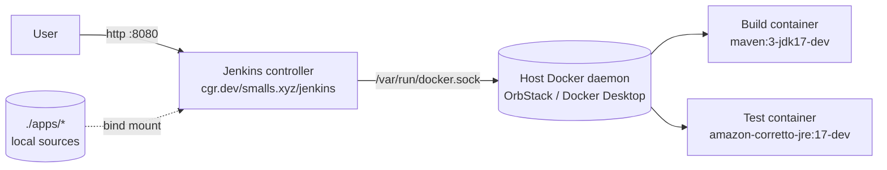

# Chainguard Jenkins Demo

A self-contained Jenkins server running on Chainguard images, with pipeline jobs that build and test sample applications using Chainguard `*-dev` build images and Chainguard runtime images.

All Jenkins infrastructure and all build/test/runtime images come from `cgr.dev/smalls.xyz`.

## How it works



Jenkins is built from [Dockerfile.jenkins](Dockerfile.jenkins), which layers a fixed plugin set and the Chainguard `docker-cli` binary onto `cgr.dev/smalls.xyz/jenkins:2-lts-jdk21-dev` (the controller runs on JDK 21; sample apps targeting older JDKs build inside their own per-stage Chainguard images). On startup, [Jenkins Configuration as Code (JCasC)](jenkins/casc/jenkins.yaml) creates the admin user and seeds pipeline jobs from [jobs.groovy](jenkins/casc/jobs.groovy) by reading each app's `Jenkinsfile` from disk.

The controller talks to the **host's Docker daemon** via the mounted `/var/run/docker.sock` (DooD pattern). When a pipeline stage uses `agent { docker { image '...' } }`, Jenkins asks the host to spawn the build container. To make this work cleanly, `JENKINS_HOME` is bind-mounted from `/tmp/cgjenkins-home` at the **same absolute path on host and container** — so when the controller hands the host a `-v <workspace>:<workspace>` flag, the workspace path actually exists on the host.

Each sample application lives under [apps/](apps/) as if it were a separate repository. The controller's first pipeline stage (`Checkout`) copies the app sources from the bind-mounted `/sources/apps/<name>/` into the workspace. Subsequent stages stash/unstash to share artifacts.

## Prerequisites

- Docker (Docker Desktop, OrbStack, or Linux Docker engine)
- `chainctl` CLI, authenticated against an org with access to `cgr.dev/smalls.xyz/*`

Verify auth:
```sh
chainctl auth status
```

## Quick start

**Step 1 — Generate the registry pull token.** [setup.sh](setup.sh) calls `chainctl auth pull-token create` and writes a Docker config to `.secrets/docker-config.json` (gitignored). Re-run when the token expires (default TTL is 30 days).

```sh
cd jenkins
./setup.sh
```

**Step 2 — Start Jenkins.**

```sh
docker compose up -d --build
```

Wait ~30s for Jenkins to finish initial startup (watch with `docker compose logs -f jenkins`), then open <http://localhost:8080> and log in:

- Username: `admin`
- Password: `admin` (override via `JENKINS_ADMIN_PASSWORD` env in [docker-compose.yml](docker-compose.yml))

You should see one job, **corretto-java17-maven**. Click it → **Build Now**. The build runs four stages:

1. **Checkout** — copies sources from `/sources/apps/corretto-java17-maven/` into the build workspace.
2. **Build** — `cgr.dev/smalls.xyz/maven:3-jdk17-dev` runs `mvn package`, producing `target/app.jar`.
3. **Test** — `cgr.dev/smalls.xyz/amazon-corretto-jre:17-dev` runs the JAR as a smoke test.
4. **Archive** — Jenkins archives `target/app.jar`; download from the build's "Build Artifacts" link.

A clean build takes ~25s once images are cached locally.

## Adding another sample app

1. Create a directory under [apps/](apps/), e.g. `apps/python314-flask/`.
2. Add the application source plus a `Jenkinsfile`. The pipeline's first stage should be a `Checkout` that does `cp -R /sources/apps/<name>/. .`.
3. **Important:** in every `agent { docker { image '...' } }` block, add `args '--entrypoint='` so Jenkins can run `cat` to keep the container alive (Chainguard images all have a baked-in ENTRYPOINT pointing at the main binary).
4. Append one block to the `apps` list in [jenkins/casc/jobs.groovy](jenkins/casc/jobs.groovy).
5. `docker compose restart jenkins` — JCasC re-runs the seed and the new job appears.

## Teardown

```sh
docker compose down
sudo rm -rf /tmp/cgjenkins-home   # remove the persisted Jenkins home
rm -rf .secrets                   # remove the pull-token Docker config
```

## Notes

- The Test stage uses the `-dev` variant of the runtime image (`amazon-corretto-jre:17-dev` rather than `:17`) because Jenkins' `docker { image ... }` agent invokes `sh` steps, which require a shell. The shell-less runtime image is still the production deployment target — the `-dev` variant is purely a CI convenience for driving the JVM under Jenkins.
- The DooD pattern means Jenkins effectively has root-equivalent access to the host machine via the Docker socket. This is acceptable for a local demo but not for production.
- See [PLAN.md](PLAN.md) for the full list of sample apps planned. Currently only the first (Corretto Java 17 + Maven) is implemented; the rest will be added one at a time.
